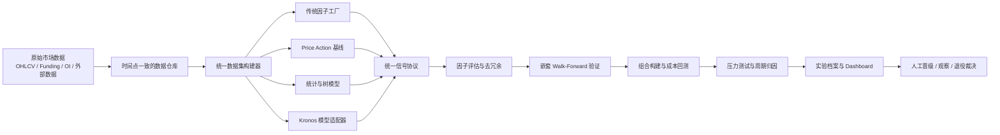

# 量化研究平台设计规范

**状态：** 已批准设计，等待书面规范复核

**日期：** 2026-07-29

**基线：** `main@59e8bcb`（PA Quant Dashboard v2.1）

**研究归档：** `round8-archive@d413eda`

## 1. 目标

将 bianV2 从单一 Price Action 回测项目演进为可持续运行的量化研究平台。平台必须能够持续生成和评估候选因子，在严格隔离的时间样本外验证中抵抗周期变化，完整建模交易成本，并通过可读报告和 Dashboard 让用户参与关键裁决。

平台首先服务研究与回测。实盘交易所接入、真实资金下单和密钥管理不在当前范围；只有多个锁定 OOS 版本稳定通过后，才进入实时重放和模拟盘设计。

## 2. 成功标准

- 同一代码提交、数据快照、配置与随机种子可以复现实验结果。
- 所有候选信号通过同一数据接口、时间切分、成本模型和晋级门槛评估。
- 常规成本下，正式候选在不少于 70% 的外层 walk-forward 窗口取得正收益。
- 正式候选的 OOS Sharpe 中位数不低于 0.8，block bootstrap 下界高于 0。
- 组合常规 OOS 最大回撤不超过 15%，压力测试最大回撤不超过 25%。
- 收益不能由单个币、单个年份、单一市场状态或少数交易主导。
- 每个结果都能追溯到数据版本、代码版本、配置、环境和人工裁决。
- 日常任务自动运行；只有晋级、退役、结构变化、数据异常和资源超限需要人工批准。

这些标准是正式候选的必要条件，不承诺未来收益，也不能把统计通过等同于可实盘交易。

## 3. 设计原则

1. 数据事实与研究解释分离：原始数据只追加，不被研究代码覆盖。
2. 时间点一致：回测只能使用当时已经可获得的数据。
3. 模型平权：PA、传统因子、树模型和 Kronos 都是候选信号提供者。
4. 失败留痕：无效因子、负面实验和退役结论长期保留。
5. 双层验证：大规模快速筛选与高保真事件回测分开执行。
6. 人机分工：程序负责计算、筛选和归档；用户负责关键研究裁决。
7. 渐进复杂化：当前本地机器能够完成的部分优先；算力与编排系统按证据升级。

## 4. 总体架构

Dashboard 只读取已落盘的实验产物。展示代码不得参与指标计算，模型不得拥有绕过统一验证器的专用回测路径。

## 5. 研究宇宙与数据频率

研究宇宙采用两层结构：

- 核心研究集：BTC、ETH。使用最长可获得历史、最完整的数据源，承担因子发现和模型训练。
- 迁移验证集：5–8 个满足点时流动性门槛的永续合约。它们主要验证结论能否离开 BTC/ETH；不得按今天的存活币种回填历史成分。

系统保留可信的较细基础频率，并生成 1h、4h、1d 研究数据。1h/4h 用于信号研究，1d 用于长周期状态识别。增加 K 线数量不等于增加独立样本量；所有统计检验必须考虑自相关与重叠标签。

## 6. 数据底座

### 6.1 存储

- Parquet：不可变数据分区、特征矩阵、交易明细和批量实验指标。
- DuckDB：本地分析查询、时间聚合和跨分区扫描。
- SQLite：实验状态、因子注册表、人工裁定和小型元数据事务。

### 6.2 数据层

| 层级 | 内容 | 约束 |
|---|---|---|
| Raw | 数据源原始响应或原始文件 | 只追加，保存来源与校验值 |
| Canonical | 统一币种、字段、时区和频率的数据 | 可由 Raw 完全重建 |
| Research | 标签、因子、regime 和模型样本 | 绑定生成配置与代码提交 |

每条记录包含：

- `event_time`：市场事件实际发生时间。
- `available_time`：研究者最早能够获得该记录的时间。
- `ingested_at`：本地抓取时间。

数据集构建器只能按 `available_time` 查询。现有 CSV 以 `legacy-v1` 快照导入，用于复现旧结果，不作为长期数据口径。

### 6.3 初始免费数据

- OHLCV、标记价格、资金费率、未平仓量。
- Fear & Greed、稳定币供给、DeFi TVL、宏观流动性代理。
- 合约上线、下线、符号变化与历史研究宇宙成分。

第一阶段只使用可追溯的免费公开数据。付费数据必须先证明免费代理变量不足、增益可测且成本可控，再提交人工审批。

### 6.4 数据质量门

自动检测时间缺口、重复记录、OHLC 关系错误、负成交量、跨周期聚合不一致、来源延迟、异常跳变与历史修订。严重缺陷阻断所有依赖实验；可容忍缺陷必须按预先登记的处理规则执行并写入报告，禁止静默填补。

## 7. 因子研究系统

### 7.1 研究轨

1. 可解释因子：趋势、反转、波动、成交量、流动性、Funding、OI 与跨资产关系。
2. 市场状态：趋势/震荡、高低波动、流动性紧缩和杠杆拥挤。
3. 统计与树模型：正则化线性模型、LightGBM/XGBoost 等非线性组合。
4. 基础模型：Kronos 及以后接入的时序模型。

### 7.2 因子契约

每个因子必须登记唯一 ID、版本、公式、方向、经济假设、数据依赖、最早可用时间、预测周期、缺失值规则、异常值规则、标准化方法、适用状态、失效条件、父因子和生成代码提交。

统一信号协议至少包含 `asset`、`decision_time`、`horizon`、`value`、`confidence`、`factor_id`、`factor_version` 和 `available_time`。组合与回测层只消费该协议。

### 7.3 因子状态

`researching → observed → candidate → approved → retired`

任何状态变化都由验证结果和裁定记录驱动。退役不删除历史；当新证据满足预先登记的重启条件时，可以重新进入研究状态。

### 7.4 评估

- IC/RankIC、Newey-West 或 block bootstrap 置信区间。
- 年份、币种、时间周期和 regime 的方向一致性。
- 换手率、成本后收益、信号衰减、容量代理与持仓集中度。
- 与已批准因子的相关性、聚类位置和组合增量贡献。
- 多重试验校正、参数扰动、数据扰动和标签扰动。

自动搜索必须记录完整搜索空间和尝试次数。结果选择只能发生在内层训练/验证窗口，不能利用外层 OOS 排名。

## 8. Kronos 适配策略

Kronos 被定位为候选模型因子生成器，不是直接交易策略。适配器从多路径预测中派生：

- 未来收益中位数和方向概率。
- 预测路径分歧与置信度。
- 预测波动率、最高/最低区间与路径回撤。
- 模型残差、重构异常度或稳定嵌入特征。

每种派生量都是独立因子，经过同一评估和回测流程。Kronos 必须先击败最后价格不变、简单动量、简单均值回归及轻量机器学习基线。

接入时固定上游仓库提交、模型权重校验值、推理参数和环境。零样本权重不得默认可信：Kronos 曾修复微调数据按完整窗口归一化造成的未来信息泄漏，但公开预训练权重是否在修复后重新训练仍未明确；公开复现实验也报告了零样本预测跑输持久性基线，以及微调损失下降但交易结果不稳定的问题。因此首轮只做隔离零样本基准，微调必须在泄漏审计、任务目标对齐和算力审批后进行。

参考：

- [Kronos 仓库](https://github.com/shiyu-coder/Kronos)
- [未来信息泄漏修复讨论](https://github.com/shiyu-coder/Kronos/issues/227)
- [公开权重是否重训的未决问题](https://github.com/shiyu-coder/Kronos/issues/307)
- [零样本对持久性基线复现实验](https://github.com/shiyu-coder/Kronos/issues/354)
- [微调与 walk-forward 负面结果](https://github.com/shiyu-coder/Kronos/issues/355)

## 9. 验证与回测

### 9.1 双层引擎

- 快速层：向量化评估大量候选因子，用于初筛、相关性分析和敏感性检查。
- 精确层：事件驱动组合回测，模拟订单时序、持仓、手续费、滑点、Funding、同 K 线冲突和信号延迟。

快速层结果不能直接晋级正式候选。

### 9.2 时间切分

采用嵌套 anchored walk-forward：内层用于因子选择和参数确定，外层用于 OOS 验证，最后一段历史作为锁定测试集。重叠标签必须 purge，训练与测试间必须设置与预测周期一致的 embargo。锁定测试集在版本发布前只允许运行一次；失败后创建新研究版本，不能反复调参继续窥探原测试集。

### 9.3 场景矩阵

每个正式候选同时运行理想成交、常规成本、成本加倍、延迟一根 K 线、参数扰动、数据缺口、异常价格、核心币和迁移验证币场景。结果按牛市、熊市、震荡、高波动和流动性紧缩状态归因。

### 9.4 晋级门

除第 2 节量化标准外，还必须满足：

- 相对预先登记的朴素基线具有稳定增量。
- 参数小幅变化后结论不反转。
- 没有无法解释的集中收益来源。
- 数据、泄漏、复现与成本检查全部通过。
- 最终锁定测试集通过并经人工批准。

## 10. 实验档案、日志与 Dashboard

每次运行生成唯一 `run_id`，保存数据快照 ID、代码提交、配置、种子、环境、阶段耗时、资源使用、窗口指标、交易明细、失败原因、图表和相对正式版本的差异。

日志分为：

- 工程日志：结构化 JSONL，字段至少包含时间、级别、`run_id`、阶段、数据集、因子、fold、资产和错误码。
- 决策报告：Markdown 与结构化 JSON，回答发生了什么、为什么重要、证据强度、影响和建议动作。

Dashboard 页面：

1. 系统健康：数据新鲜度、任务、磁盘、CPU、GPU和内存。
2. 研究漏斗：生成、失败、观察、候选和晋级数量。
3. 实验详情：窗口结果、成本、稳定性和失败原因。
4. 因子档案：公式、假设、版本、相关性和状态历史。
5. 周期归因：币种、年份和 regime 的收益风险拆分。
6. 决策中心：等待批准的晋级、退役、结构变化和资源申请。

任务结束总是保存完整产物；每日生成摘要；每周生成研究报告；关键门槛暂停相关流水线并等待人工裁决。人工决定保存为批准、拒绝或继续观察，并附备注、时间和对应证据。

## 11. 运行状态与错误隔离

实验状态为 `queued → running → passed/failed/blocked`。不完整运行不能参与排名；手动重跑生成新 `run_id`；失败模型只隔离对应模型轨；数据质量失败阻断全部依赖任务；报告生成失败不能把运行标记为研究通过。

关键任务记录可机器判定的错误码。自动重试只用于瞬时网络或资源错误，逻辑错误、数据错误和验证失败不自动重试。

## 12. 技术栈与运行环境

- WSL2 Ubuntu、Python 3.11、`uv` 锁定依赖。
- Parquet、DuckDB、SQLite、Pydantic、Typer。
- pandas 作为模型边界格式，DuckDB/Polars 承担批量扫描与计算。
- pytest、Hypothesis、scikit-learn、LightGBM。
- PyTorch/Kronos 作为独立可选依赖组。
- FastAPI + Plotly 延续现有 Dashboard 技术。
- 初期使用 WSL 定时任务；出现真实并发、重试和多机需求后再评估 Prefect。

当前 Ryzen 7 6800H、16GB RAM、RTX 3060 Laptop 6GB 适合因子计算、传统模型、Kronos mini/small 推理和低批量 base 推理，不适合大规模微调。升级顺序为 32–64GB 内存、至少 1TB NVMe，再根据已验证价值选择 12–24GB 显存 GPU 或按需云 GPU。

## 13. 测试策略

- 数据契约、时间缺口、重复、跨周期聚合和点时查询测试。
- 人工注入未来数据的泄漏哨兵测试。
- 信号时间、标签边界、purge/embargo 属性测试。
- 手续费、滑点、Funding、信号延迟和同 K 线冲突测试。
- 固定快照的黄金回归与跨环境复现测试。
- 数据读取到报告生成的端到端测试。
- 峰值内存、运行时间和模型推理预算测试。
- Dashboard API 只读性及其不参与研究计算的边界测试。

## 14. 交付阶段

1. 冻结 Baseline-0：复现旧 PA 与实验协议，修正测试和依赖入口。
2. 可信数据底座：核心数据、版本、质量门和 point-in-time 查询。
3. 统一实验与回测：信号协议、双层引擎、成本和嵌套 walk-forward。
4. 因子工厂：可解释因子、评估、聚类、去冗余和状态机。
5. Dashboard 与决策中心：健康、漏斗、档案、归因和裁定。
6. 统计模型与 Kronos：基线模型先行，Kronos 隔离竞争。
7. 持续研究循环：更新、生成、验证、归档、日报和周报。
8. 模拟盘准备：仅在多个锁定 OOS 版本通过后开展实时重放与 paper trading。

每个阶段必须独立产生可运行、可测试、可理解的交付。阶段验收失败时停止扩张并修复，不依赖后续模块掩盖问题。

## 15. 明确不做

- 当前阶段不接真实交易所下单、不保存实盘 API 密钥。
- 不以单次累计收益或单个模型截图作为晋级依据。
- 不使用随机时间切分验证时序策略。
- 不为了提高指标删除失败年份、失败币种或异常成本场景。
- 不在没有证据时引入分布式数据库、多机调度或大模型微调。
